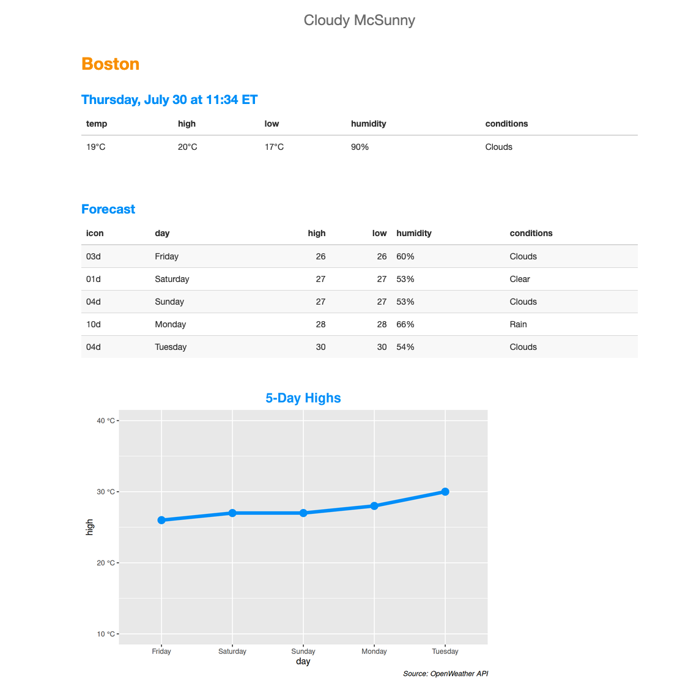

# Cloudy McSunny

This is a demonstration of Parameterized RMarkdown for [Posit Connect](https://posit.co/products/enterprise/connect).

## deployment
1. Get a free API key from the [OpenWeather](https://openweathermap.org/api) project.
1. Add this repo to a Posit Connect server via the **Import from Git** feature.
  - this will fail because the API key has not been set for the content yet.
3. Open **Settings**, select the **Runtime** tab and click **Add variable** in the **Environment Variables** section.
4. Set the variable like so:
  - **Name:** `OWM_API_KEY`
  - **Value:** `<your OWM API key>`
5. Save changes
6. Close Settings and click **Refresh**.

## screenshot
